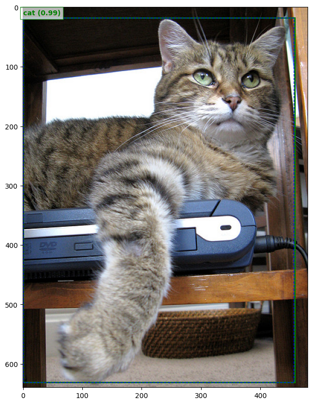
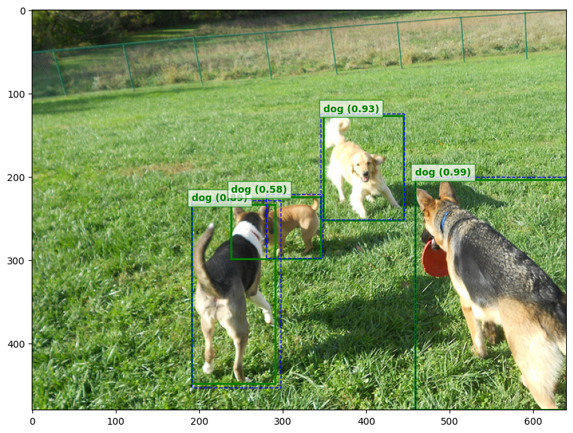

# Training Ultralytics YOLOv11 Object Detection on Google Colab

This repository has the resource files used in [this post](https://medium.com/p/39bba09530ff), shows how to train the [Ultralytics YOLOv11](https://github.com/ultralytics/ultralytics) object detector on [this Cats and Dogs custom dataset](https://www.kaggle.com/datasets/estebanuriz/cats-and-dogs-for-object-detection), using Google Colab.

Here you can find the [pre-trained weights](runs/train/weights/best.pt).

## Some prediction results

